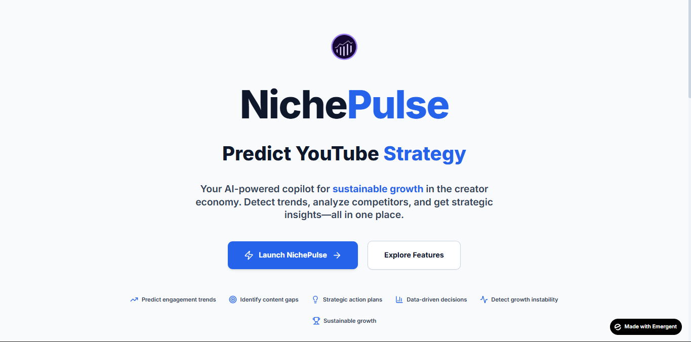
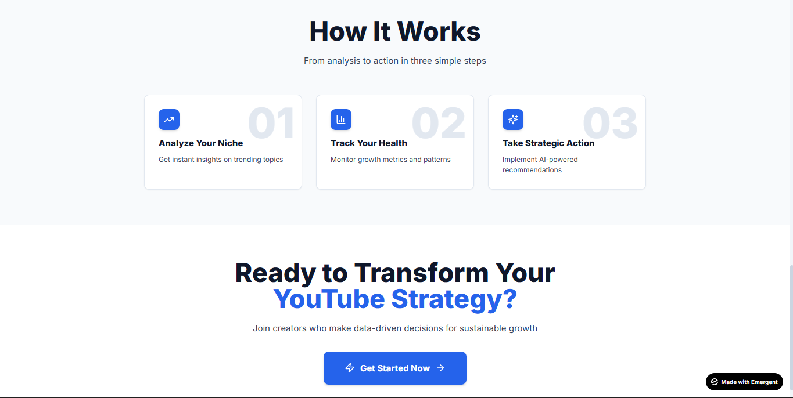
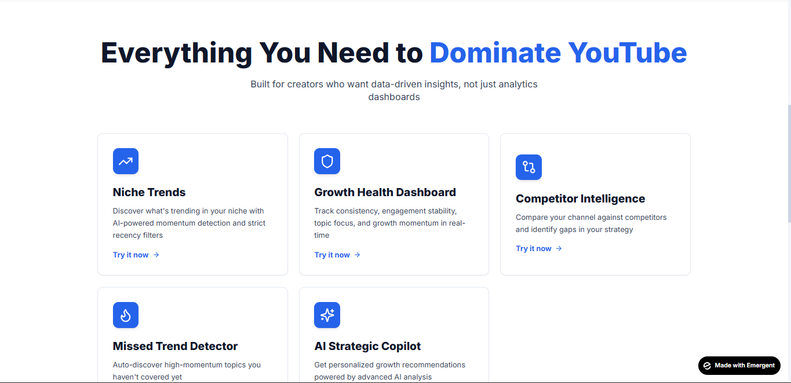

<div align="center">

# 📊 NichePulse

### AI-Powered YouTube Analytics Platform

**Stop guessing what to post next. Know it, before your competitors do.**

Built at **HALLUCINATE**, a hackathon conducted by Emergent — by **Team Z**

[](#license)
[](#tech-stack)
[](#tech-stack)
[](#tech-stack)
[](#tech-stack)

 [Features](#-features) · [Getting Started](#-getting-started) · [Tech Stack](#-tech-stack)



</div>

---

## 🧠 Overview

**NichePulse** is an AI-powered YouTube analytics platform that turns raw channel data into actionable growth strategy. It combines the **YouTube Data API v3** with **Google Gemini AI** to surface emerging trends, benchmark competitors, and score channel health — all before a creator sits down to plan their next video.

**What we built:**
- 🔍 Analyzed YouTube channels to identify emerging niche trends, competitor benchmarks, and missed content opportunities
- 🤖 Generated AI-driven strategic recommendations using Google Gemini for smarter creator growth decisions
- 📈 Developed an interactive dashboard integrating the YouTube Data API with real-time analytics and channel health scoring

---

## ✨ Features

### 🚀 Niche Trends Explorer `/niche-trends`
- Discover trending videos in your niche from the **last 5 days**
- AI-powered **momentum scoring** to catch what's gaining traction early
- Click any video to get an AI analysis with creator angle suggestions

### 🩺 Channel Analysis `/channel-analysis`
Paste any YouTube channel URL for a full growth health workup.

**Growth Health Dashboard — 4 key scores:**

| Score | What It Measures |
|---|---|
| **Consistency Score** | Upload regularity |
| **Engagement Stability** | Audience interaction patterns |
| **Topic Focus Score** | Content coherence across videos |
| **Growth Momentum** | Channel trajectory indicator |

- **Missed Trend Detection** — topics in your niche you haven't covered yet
- **Competitor Comparison** — side-by-side benchmarking against rivals
- **AI Strategic Summary** — risks, opportunities, and action plans



### 📊 Interactive Dashboard `/dashboard`
- Visual charts and graphs for channel metrics
- Radial gauges for health scores
- Bar / Line / Pie charts for views, engagement, and themes
- Quick stats cards: Subscribers, Engagement Rate, Videos/Month



### 💬 AI Copilot Chat *(Global)*
- Contextual AI assistant available on **every page**
- Ask questions about your current analysis
- Get personalized, real-time growth recommendations

---

## 🏗️ Tech Stack

| Layer | Technology |
|---|---|
| **Frontend** | React, Tailwind CSS, Recharts, Framer Motion |
| **Backend** | FastAPI (Python) |
| **AI** | Google Gemini AI |
| **External API** | YouTube Data API v3 |
| **Database** | None (Stateless) |

---

## 🔄 User Flow

```
 Creator visits NichePulse
            │
            ▼
 Enters YouTube channel URL or selects a niche
            │
            ▼
 System fetches data from YouTube Data API v3
            │
            ▼
 Google Gemini AI analyzes and generates insights
            │
            ▼
 Creator sees health scores, trends, and recommendations
            │
            ▼
 Views interactive dashboard with charts
            │
            ▼
 Takes action based on the AI strategic plan
```

---

## 🚦 Getting Started

### Prerequisites
- Node.js ≥ 18
- Python ≥ 3.10
- YouTube Data API v3 key
- Google Gemini API key

### Installation

```bash
# Clone the repository
git clone https://github.com/Savyasachi-2005/TeamZ_Hallucinate.git
cd TeamZ_Hallucinate
```

**Frontend**
```bash
cd frontend
npm install
npm run dev
```

**Backend**
```bash
cd backend
pip install -r requirements.txt
uvicorn main:app --reload
```

### Environment Variables

Create a `.env` file in the `backend` directory:

```env
YOUTUBE_API_KEY=your_youtube_data_api_key
GEMINI_API_KEY=your_google_gemini_api_key
```

---

## 🗺️ Pages & Routes

| Route | Feature |
|---|---|
| `/` | Landing / Home |
| `/niche-trends` | Niche Trends Explorer |
| `/channel-analysis` | Channel Health Analysis |
| `/dashboard` | Interactive Metrics Dashboard |

---

## 💡 Value Propositions

| Benefit | Description |
|---|---|
| **Stop Guessing** | Data-driven content decisions replace intuition |
| **Find Trends Early** | 5-day recency filter catches momentum before it peaks |
| **Know Your Health** | Clear scores across consistency, engagement, and focus |
| **Beat Competitors** | Side-by-side comparison insights |
| **Never Miss Trends** | Auto-detect topics your channel hasn't covered |
| **AI Strategy** | Personalized growth action plans on demand |

---

## 🧩 Team

Built by **Team Z** at the HALLUCINATE hackathon (Emergent).

---

## 📄 License

MIT © NichePulse
